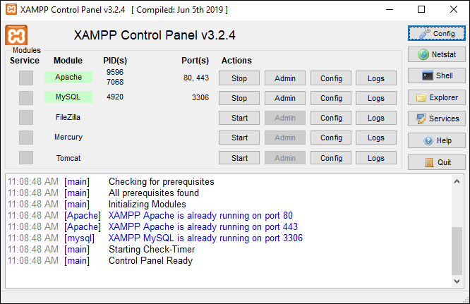
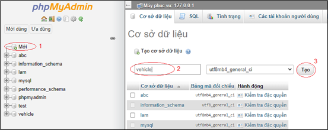
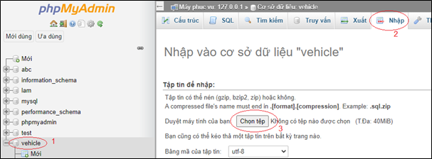
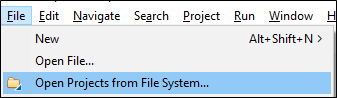
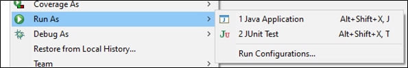
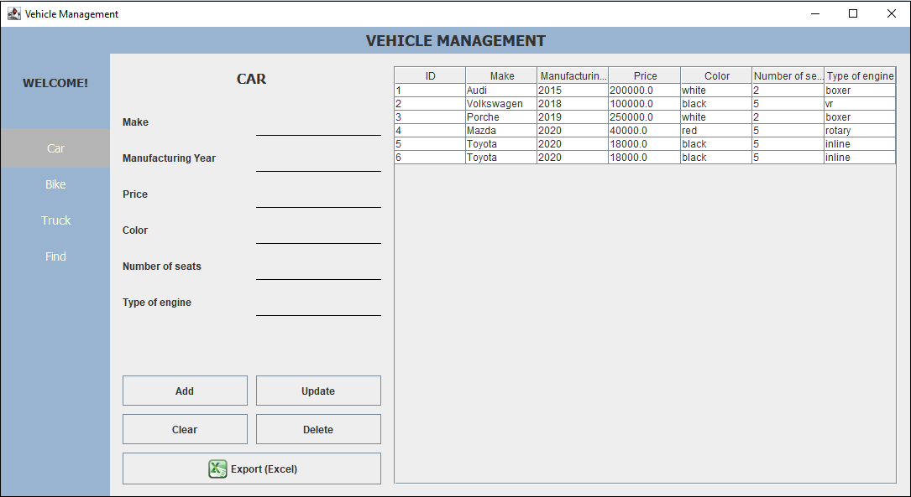
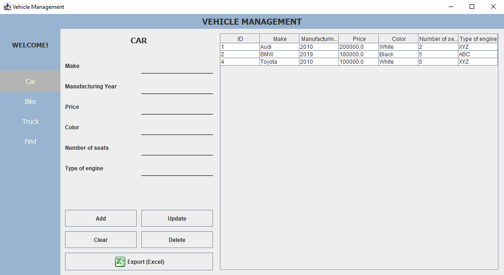
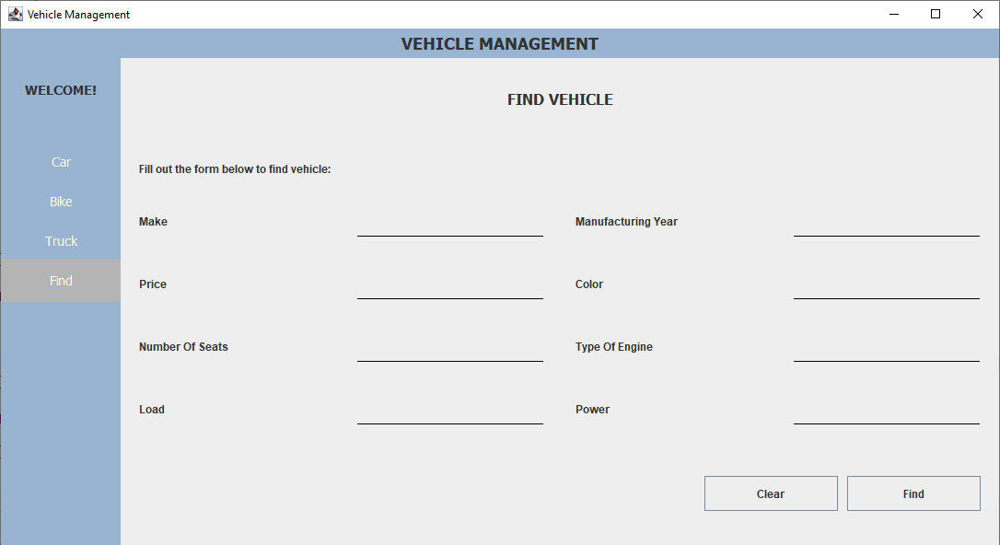
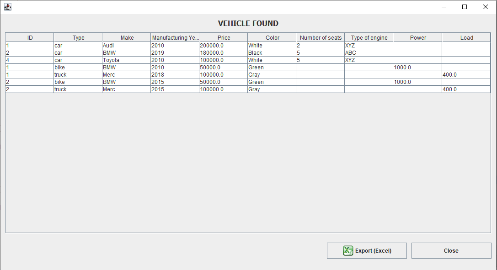

# miniproject-detai7
#group 7.1

Hướng dẫn sử dụng:

1.	Tải và cài đặt môi trường

Bước 1: Tải các ứng dụng tạo môi trường. 
-	Tải JDK phù hợp với hệ điều hành tại trang chủ của Oracle https://www.oracle.com/java/technologies/javase/javase-jdk8-downloads.html.
-	Tải và cài đặt Eclipse IDE theo hướng dẫn sau: https://o7planning.org/vi/10379/huong-dan-cai-dat-va-cau-hinh-eclipse
-	Tải và cài đặt XAMPP tại https://www.apachefriends.org/index.html

Bước 2: Bật XAMPP, sau đó nhấn vào nút Start tại Apache với MySQL. Nếu Apache và MySQL hiện màu xanh như trong hình là thành công
 
 
Bước 3: Bật ứng dụng duyệt web (Chrome, Cốc cốc,…), truy cập vào đường dẫn localhost/phpmyadmin
-	Tại giao diện phpmyadmin, ta làm các bước sau:

Lưu ý: Đặt tên cơ sở dữ liệu là “vehicle”.

-	Nhấn vào cơ sở dữ liệu vừa tạo, làm các bước như ảnh. Tại phần chọn tệp, ta chọn đường dẫn tới tệp “vehicle.sql”, sau đó kéo xuống và chọn thực hiện.

Bước 4: Giải nén file vừa tải về, bật Eclipse
-	Chọn File, sau đó chọn Open Projects from File System
 
 
-	Cửa sổ Import Projects from File System or Archive hiện ra, chọn Directory sau đó chọn đường dẫn đến file vừa giải nén rồi ấn Select Folder. Nhấn Finish để thêm project.

Bước 5: Tại thanh Project Explorer ta thấy xuất hiện project có tên “miniproject-detai7-master”, chuột phải vào project, chọn Run As sau đó chọn Java Application.
 
 
2.	Hướng dẫn sử dụng chương trình.
 
 
Để thêm, sửa, xóa, xuất file Excel thông tin của xe, bạn chọn ở thanh bên trái loại xe mà mình muốn tác động. Sau đó ấn nút tương ứng với hành động mình muốn làm:
-	Nút Add (1): Thêm dữ liệu đã nhập vào bảng
-	Nút Update (2): Chọn 1 hàng trong bảng, dữ liệu của hàng sẽ được điền vào các ô chữ để người dùng thay đổi. Sau khi thay đổi xong thì ấn nút Update để cập nhật lại vào bảng.
-	Nút Clear (3): Dùng để xóa hết các chữ trong các ô chữ.
-	Nút Delete (4): Dùng để xóa thông tin các xe trong bảng, yêu cầu chọn hàng trước.
-	Nút Export (Excel) (5): Để xuất file Excel từ bảng.
Để tìm kiếm xe, người dùng điền thông tin vào các trường thông tin (có thể để trống) rồi ấn nút Find.

Demo chương trình:

